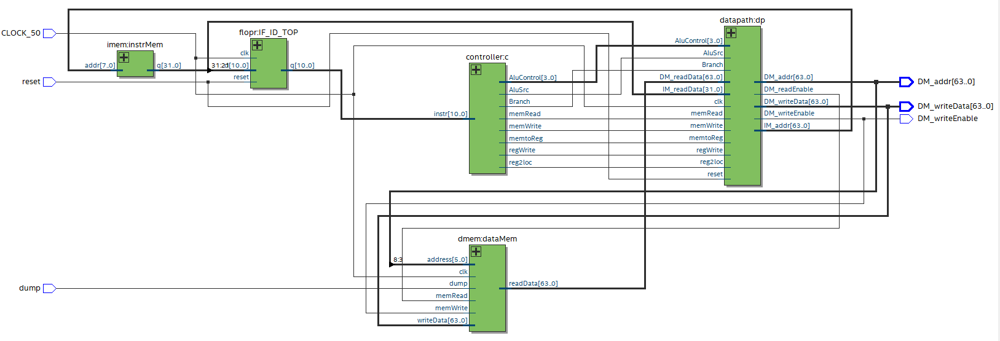
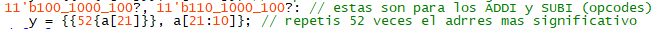
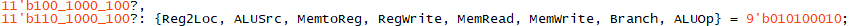
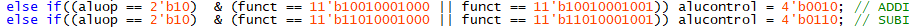
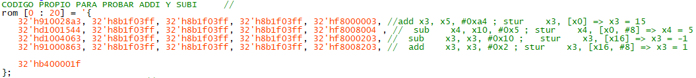

# FaMAF-UNC: Arquitectura de Computadoras 2024 - g31

*** 

# Trabajo Práctico 1

## Integrantes g31
* Joaquín Dubois
* Mateo Ricci Villarruel
* Ignacio Augusto Ramírez

 

A continuación se realizará una descripción de las modificaciones realizadas por la introducción del pipeline a los módulos del proyecto y los cambios realizados para el cumplimiento de los requerimientos del Ejercicio 1 del laboratorio 1 de la cátedra.

### Modificaciones introducidas para pipeline

* **``regfile.sv``**: 
    - Inicializamos los registros X0 a X30 con los valores 0 a 30 respectivamente.
    - Se modificó el bloque `regfile` para que si alguno, o ambos registros leídos por una instrucción en la etapa `decode`, están siendo escritos como resultado de una instrucción anterior en la etapa `writeback`, se obtenga a la salida de `regfile` el valor actualizado del registro.

* **``decode.sv``**:  
    * Se agrega puerto de entrada.

* **`imem.sv`**: 
    * Se agregan 2 bits de address (de 6 a 8 bits).
    * La memoria ROM se agranda a 256 operaciones.
    * Se cargan en la `imem` los nops necesarios para manejar hazards.

* **`processor_arm.sv`**:
    * Se agregan 2 bits de address a la imem (de [7:2] a [9:2]).

* **`processor_tb.sv`**:
    * Se cambia el valor de `dump` de 800 a 1600 para la correcta ejecución del código.

## Ejercicio 1

**Se modificaron los módulos:** 

* **`signext.sv`**: Se agregan dos líneas para obtener el opcode de las operaciones ADDI (488/489) y SUBI (688/689), y posteriormente realizar la extensión de signo del bit más significativo del ALU_Immediate 
`11'b100_1000_100?, 11'b110_1000_100?:`
`y = {{52{a[21]}}, a[21:10]};`  

    
 
 

* **`maindec.sv`**: Asignan nueve bits del módulo CONTROLLER ya que luego se utilizan para el datapath.

    
 
 

* **`aludec.sv`**: Dados los inputs `aluop` y `funct` (opcode de la operación a realizar) nos aseguramos que el aluop tenga el valor `b10` indicando que la operación es de tipo aritmética o lógica, y que funct tenga los valores `488-489` para ADDI o `688-689` para SUBI, y asignamos a la salida alucontrol la operación que debe realizar la ALU: `b0010` si la operación es ADDI, `b0110` si es SUBI.

    

**Código de testing:**

#### Se implementó el siguiente código para testear las operaciones ADDI y SUBI, y la generación de overflow:

El programa creado para verificar que la funcionalidad del ADDI y SUBI sea correcta utiliza las instrucciones NOP (`32'h8b1f03ff`) para evitar hazard de datos o control.

    add    x3, x5, #0xa4
    stur   x3, [x0, #0]    => x3 = 15
    sub    x4, x10, #0x5
    stur   x4, [x0, #8]    => x4 = 5
    sub    x3, x3, #0x10 
    stur   x3, [x16, #0]   => x3 = -1
    add    x3, x3, #0x2 
    stur   x3, [x16, #8]   => x3 = 1

